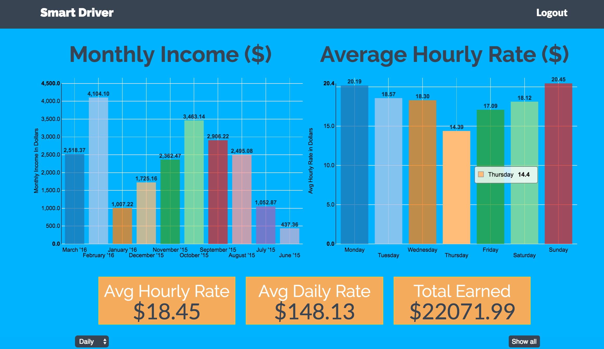
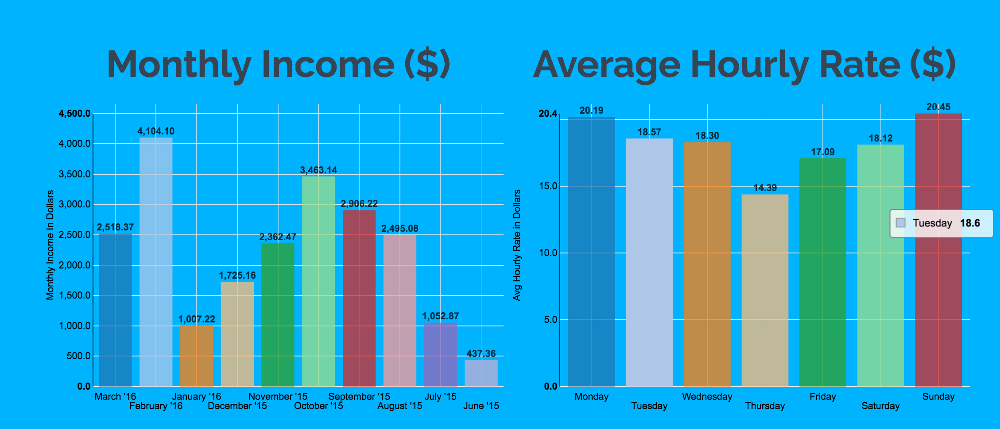
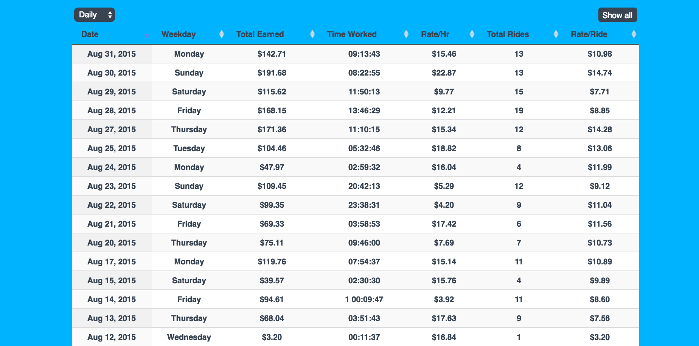

### **Smart Driver** is a dynamic web app that provides Uber Drivers the crucial data analysis they need to succeed.




## Table of Contents  
* [Features](#features)  
* [Setup](#setup)
* [Usage](#usage)
* [API](#api)
* [Developers](#developers)
<a name="headers"/>

***

## Features
##### * Streamlined Interface - simply log-in using your Uber Driver credentials and receive instant access to your entire ride history!
##### * Dynamic D3.js graphs provide both monthly and weekday data visualization for clear, concise ride info.
##### * Use _Smart Driver_ the way you want. Curious about your average hourly wage for a particular day in a specific month? Simply click on those respective fields in the graph and let _Smart Driver_ calculate the rest!
##### * _Smart Driver_ utilizes Uber's OAuth for authentication purposes. We therefore never store your passwords, for any reason, ensuring your log-in credentials and personal data are always safe.

***


###Setup

#####Install Virtual Environment/Requirements
```python
echo layout python3 > .envrc
pip install -r requirements
```

#####Create Django Project/App
```python
django-admin startproject project_name
django-admin startapp app_name
```

#####Run migrations to substantiate models and populate database
```python
python manage.py makemigrations
python manage.py migrate
```

***

### Usage

##### Use your _Uber Driver_ log-in credentials (email and password) to initiate _Smart Driver_


##### The two graphs at the top of the page showcase your monthly income and average hourly wage, respectively By clicking on different columns, you can adjust the info presented.  For example, if you wish to see ride info for every Tuesday in January, you would simply click on the January column in the monthly graph and Tuesday column in the average hourly rate graph.



##### The info box provides a quick summary of the relevant ride data - the average hourly rate, average daily rate, and total money earned. The info presented is based upon the graph data above, so the power to analyze different parameters is completely in your hands.


##### The final data analysis tool is the dynamic table. It is also wired up to the graph and allows total autonomy. The column headers are clickable and allow you to order the data by data, weekday, total earned, rides, and other fields.



***

### API
Our REST API supports `GET` requests and is accessible by any driver who signs in with valid Uber credentials. Our goal is to give drivers the most control over their data without compromising its accuracy or revealing sensitive information.


Example Ride Response:
```json
{
  "date": "2016-03-21",
  "status": "completed",
  "total_earned": "3.20",
  "request_at": "2016-03-21T15:58:21Z"
}
```
| Ride Endpoint | Description |
| ------------- | ------------- |
| api/rides/ | Lists all rides in our database |
| api/rides/\<trip_id\> | Retrieve a single ride by trip_id |


Example Day Statement Response:
```json
{
  "date": "Mar 22, 2016",
  "weekday": "Tuesday",
  "total_earned": "$110.18",
  "time_worked": "05:09:05",
  "rate_per_hour": "$21.39",
  "total_rides": 7,
  "rate_per_ride": "$15.74"
}
```
| Day Statement Endpoint | Description |
| ------------- | ------------- |
| api/day_statements/ | Lists all day statements in our database |
| api/day_statements/\<id\> | Retrieve a single day statement by id |
| api/day_statements/?driver=\<id\> | Lists all day statements for a single driver by driver id |
| api/day_statements/?month=\<month_name\> | Lists all day statements for days occurring in a single month, e.g. "February '15"|
| api/day_statements/?weekday=\<weekday\> | Lists all day statements occurring on a certain day of the week, e.g. "Monday" |


Example Week Statement Response:
```json
{
  "starting_at": "03-21-16",
  "ending_at": "03-27-16",
  "total_earned": "$174.92",
  "rate_per_day": "$87.46",
  "rate_per_hour": "$19.54",
  "total_rides": 13,
  "rate_per_ride": "$13.46"
}
```
| Week Statement Endpoint | Description |
| ------------- | ------------- |
| api/week_statements/ | Lists all week statements in our database |
| api/week_statements/\<id\> | Retrieve a single week statement by id |
| api/week_statements/?driver=\<id\> | Lists all week statements for a single driver by driver id |
| api/week_statements/?month=\<month_name\> | Lists all week statements including at least one day that occurs in a certain month, e.g. "February '15"|


Example Month Statement Response:
```json
{
  "month_name": "March '16",
  "total_earned": "2518.37",
  "rate_per_day": "167.89",
  "rate_per_hour": "20.30",
  "total_rides": 227,
  "rate_per_ride": "11.09"
}
```
| Month Statement Endpoint | Description |
| ------------- | ------------- |
| api/month_statements/ | Lists all month statements in our database |
| api/month_statements/\<id\> | Retrieve a single month statement by id |


Example Driver Response:
```json
{
  "url": "http://127.0.0.1:8000/api/drivers/5/",
  "first_name": "MINNIE",
  "last_name": "DRIVER"
}
```
| Driver Endpoint | Description |
| ------------- | ------------- |
| api/drivers/ | Lists all drivers in our database |
| api/drivers/\<id\> | Retrieve a single driver by id |

***

###Developers
#####  [Julio Cordoza](https://github.com/juliojr77)
#####  [Kathryn Jackson](https://github.com/katjackson)
#####  [Ryan Oakes](http://ryanoakes.github.io./)

***


### License

##### Copyright (c) 2016 - Julio Cardoza, Kathryn Jackson, and Ryan Oakes
